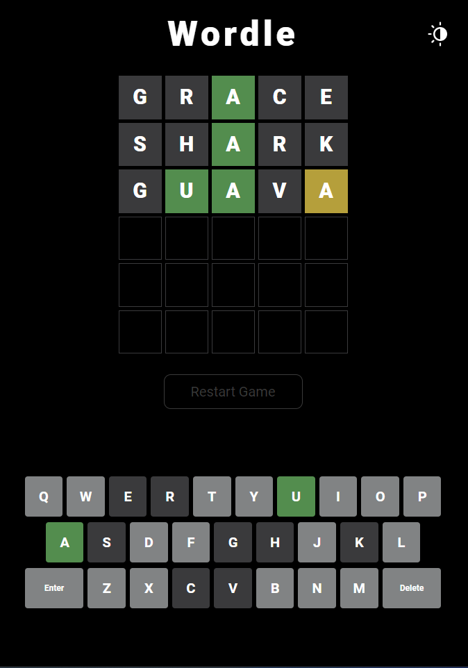
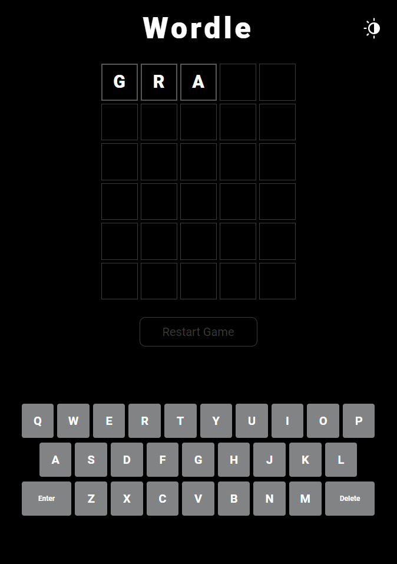
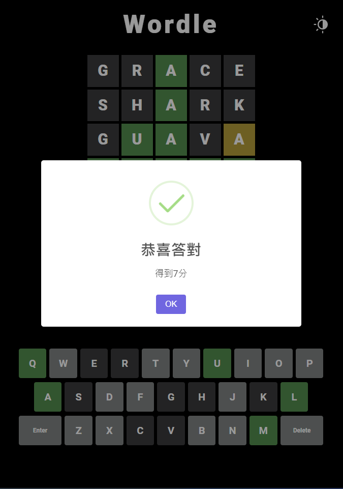
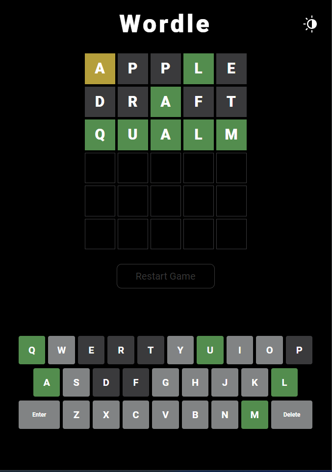
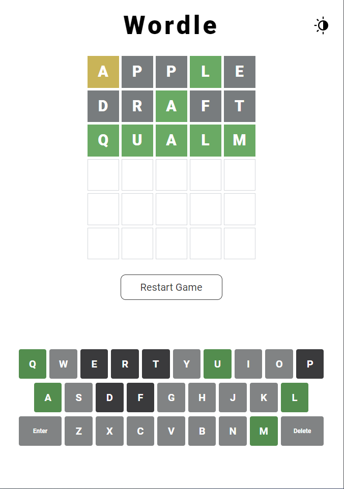

# Wordle

[Website URL](https://wordle-redux.firebaseapp.com/)

## Description

Recreate the classic wordle game, in which players need to guess the five-letter puzzle of the day within a limited number of attempts.

## Technique
- React
- Create React App
- TypeScript
- Redux Toolkit
- RTK Query
- Redux-Persist
- Firebase Firestore
- styled-components

## Feature
- If the guessed letter is in the correct position, it will be displayed in green. If the guessed letter is correct but in the wrong position, it will be displayed in yellow. If the letter is not in the puzzle word, it will be displayed in gray.
- User can either enter letters by key press or virtual keyboard.

  

- Border color will change while input.

  

- The fewer attempts the player uses to guess the puzzle word, the higher the score they will receive.

  

-Can toggle to change theme between light and dark mode.

  

